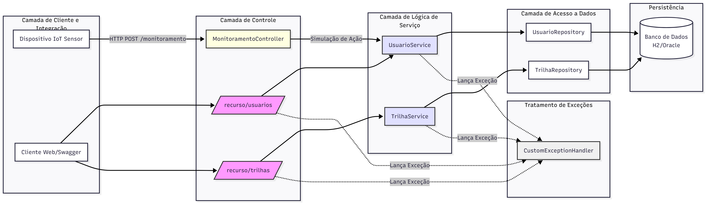

# 🤖 ErgoMind - API de Monitoramento IoT (C# / .NET)

## 👩🏻‍💻 Desenvolvido por 👨🏻‍💻
Gabriela Trevisan (RM99500), Eduardo Araujo (RM99758) e Rafael Franck (RM550875) - 3ESPW

---

## 🎯 1. Identificação e Conceito Central

| Item | Descrição |
| :--- | :--- |
| **Plataforma** | ErgoMind - Plataforma de Bem-Estar e Produtividade. |
| **Conceito Central** | API RESTful em .NET 8 que atua como **Gateway de Dados IoT**. Esta API é o ponto de entrada C# para receber, armazenar e gerenciar dados brutos de sensores (ex: postura, inatividade). |
| **Problema Solucionado** | Fadiga, má ergonomia e risco à saúde mental no trabalho remoto e híbrido. |
| **Alinhamento ODS** | **ODS 4** (Educação de Qualidade), **ODS 8** (Trabalho Decente e Bem-Estar), e **ODS 9** (Inovação e Infraestrutura). |
| **Arquitetura** | **.NET 8 Minimal API** com Entity Framework Core. |

---

## ⚙️ 2. Detalhamento de Requisitos (Entregável C#)

### 2.1. Requisito 1: Boas Práticas REST (CRUD Completo)
A API implementa o CRUD completo para o recurso `AlertaIoT`, usando os verbos HTTP e Status Codes adequados.

| Recurso | Rota Base | Métodos Implementados |
| :--- | :--- | :--- |
| **Alerta IoT** | `/api/v1/alertas` | `GET` (200), `POST` (201), `PUT` (200), `DELETE` (204) |

### 2.2. Requisito 2: Versionamento da API
Todas as rotas da API estão estruturadas sob o prefixo `/api/v1`, conforme solicitado.

### 2.3. Requisito 3: Integração e Persistência
* **Integração:** A API está conectada a um banco de dados relacional **Oracle**.
* **Persistência:** Utiliza **Entity Framework Core** com **Migrations** para criar e gerenciar o schema do banco.

### 2.4. Requisito 4: Documentação
* **Swagger:** A documentação da API é gerada automaticamente via Swashbuckle e está acessível na raiz da URL de deploy.

---

## 💻 3. Infraestrutura e Execução

### 3.1. Stack Tecnológica
* **Framework:** .NET 8 (LTS)
* **Persistência:** Entity Framework Core 8
* **Driver do Banco:** Oracle.EntityFrameworkCore
* **Documentação:** Swashbuckle.AspNetCore (Swagger)

### 3.2. Configuração do Banco de Dados: Oracle FIAP
A API utiliza a string de conexão do Oracle fornecida pela faculdade, configurada no `appsettings.json`:

```json
"ConnectionStrings": {
  "DefaultConnection": "User Id=RM99500;Password=******;Data Source=oracle.fiap.com.br:1521/ORCL;"
}
```

### 3.3. Comandos para Execução Local
Restaurar Pacotes:
```bash
dotnet restore
```
Aplicar Migrations (Criar tabelas no banco Oracle):
```bash
dotnet ef database update
```
Executar o Servidor:
```bash
dotnet run
```

A API estará acessível localmente em http://localhost:5070 (ou https_port similar).

---

## 🔐 4. Análise de Autenticação (Login/Senha vs. API Key)
O requisito da entrega menciona instruções de acesso como "(usuário, senha, ... api key, etc)".

### Por que não há Login/Senha?
Um sistema de usuário/senha não é aplicável a esta API específica. Conforme o documento da solução (ergo-mind_gs.pdf), esta API C# é um Gateway de IoT, projetada para receber dados de máquinas (sensores). A API principal de Java (SOA) é a que trata da gestão de usuários (login, cadastro, etc.).

### Como seria a proteção real
Em um ambiente de produção, esta API C# não seria pública. Ela seria protegida por uma "API Key". O dispositivo IoT (sensor) enviaria essa chave secreta no header da requisição para provar que tem permissão para registrar um alerta.

---

## 🚀 5. Link do Deploy (Azure)
A API foi publicada em um ambiente de nuvem (Azure App Service). A documentação interativa do Swagger está disponível publicamente no link abaixo:

URL do Deploy no AzureWebsites: [aqui](https://ergomind-api-2025-eqb7afdca3dmb5ff.brazilsouth-01.azurewebsites.net/)

---

## 🎥 6. Link do Vídeo de Apresentação
O vídeo de até 5 minutos, demonstrando o funcionamento da API e o cumprimento de todos os requisitos, está disponível no link abaixo:

URL do Vídeo disponível no GoogleDrive: [aqui](https://drive.google.com/file/d/1WE07xmmwkrK0wrAoEj-v4tl0GAleluBJ/view?usp=sharing)

---

### 🧪 7. Como Testar a API (CRUD)

Use o link do deploy acima para acessar o Swagger. Lá, você pode executar o ciclo de vida completo de um `AlertaIoT`.

| Ação | Método | Endpoint | JSON de Exemplo (Request Body) | Resposta Esperada |
| :--- | :--- | :--- | :--- | :--- |
| **1. Criar Alerta** | `POST` | `/api/v1/alertas` | `{"usuarioId": "RM-TESTE", "tipoAlerta": "Teste Postura"}` | `201 Created` (com o ID do novo alerta) |
| **2. Listar Alertas** | `GET` | `/api/v1/alertas` | (Nenhum) | `200 OK` (e o alerta criado deve estar na lista) |
| **3. Buscar Alerta** | `GET` | `/api/v1/alertas/{id}` | (Use o ID do passo 1) | `200 OK` (com os dados do alerta) |
| **4. Atualizar Alerta** | `PUT` | `/api/v1/alertas/{id}` | `{"usuarioId": "RM-TESTE-PUT", "tipoAlerta": "Teste Atualizado"}` | `200 OK` (com os dados atualizados) |
| **5. Excluir Alerta** | `DELETE` | `/api/v1/alertas/{id}` | (Use o ID do passo 1) | `204 No Content` |
| **6. Confirmar Exclusão**| `GET` | `/api/v1/alertas/{id}` | (Use o ID do passo 1) | `404 Not Found` (provando que foi excluído) |

---

## 🗂️ 8. Diagrama da Aplicação

O diagrama ilustra a arquitetura da **API C# (.NET 8 Minimal API)**. Ele destaca o fluxo do CRUD de 'Alertas' (`/api/v1/alertas`), que atua como o Gateway de Dados IoT, sua interação direta com o `ApiDbContext` (Entity Framework) e a aplicação automática de `Migrations` na inicialização.

<div align="center">
    
</div>
